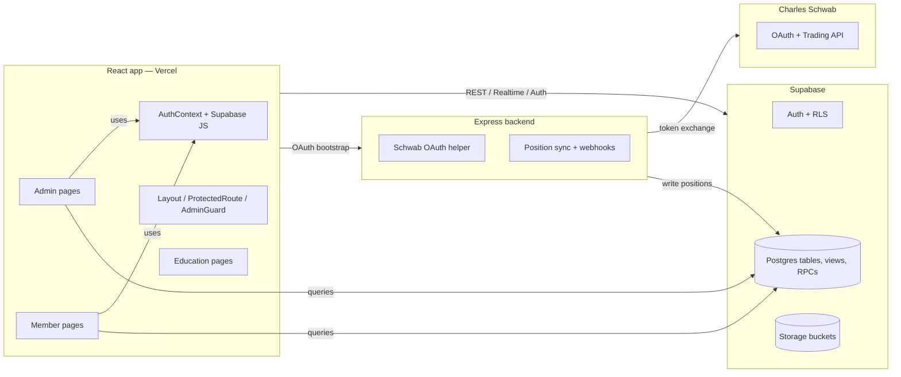
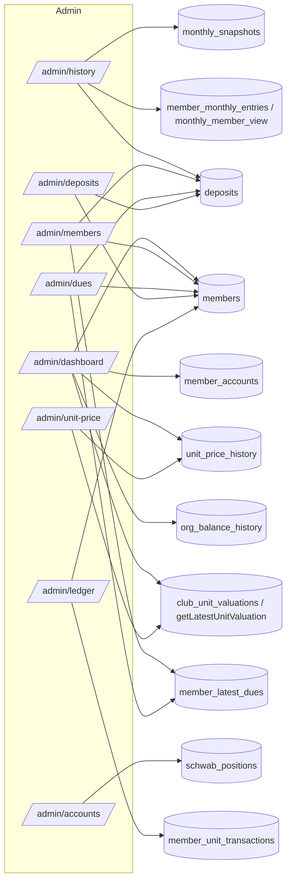
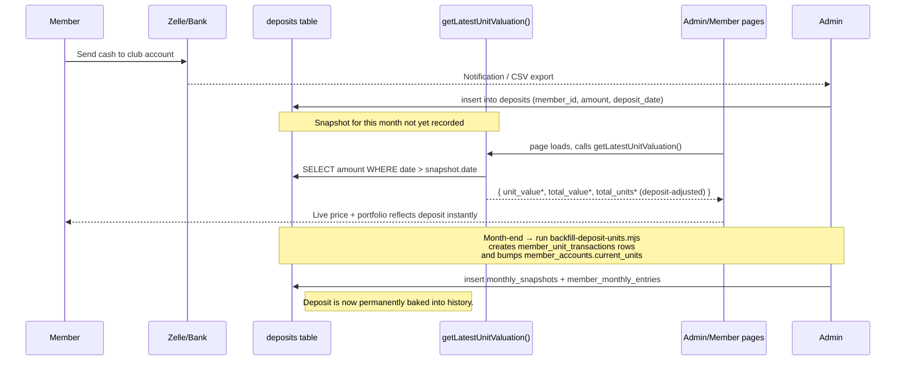

# 📘 FFA Investments — System Documentation

> **Audience:** Admins and developers maintaining the FFA Investments platform.
> **Last updated:** 2026-06-20
> **Production URL:** https://www.ffainvestments.com

This document explains the math, data sources, page-by-page formulas, directory structure, and overall architecture of the FFA Investments app.

---

## 1. Executive Summary

FFA Investments is a club portfolio-management app for tracking member contributions, units owned, and the club's total portfolio value across multiple brokerages (primarily Charles Schwab).

- **Frontend:** React 18 + Vite + React Router 6 + TanStack Query + TailwindCSS + Recharts
- **Backend:** Supabase (Postgres + Auth + RLS) + a small Express service for Schwab OAuth
- **Hosting:** Vercel (frontend) + Render/Vercel (backend)
- **Auth model:** Supabase Auth with two roles (`admin`, `member`) enforced via Row Level Security and `ProtectedRoute` / `AdminGuard`
- **Source of truth:** `monthly_snapshots` + `member_monthly_entries` (long-term history) and `deposits` (live activity since last snapshot)

The platform implements a **mutual-fund-style "unit value" system**: every dollar in the portfolio is represented as fractional units, all members own units at a single shared unit price, and deposits/withdrawals never dilute existing members because they happen at the **current** unit price.

---

## 2. The Unit Value System (Core Math)

This is the heart of the app. Every dashboard, dues calculation, and history page is derived from these formulas.

### 2.1 The three foundational formulas

```
(1) Unit Price       = Total Portfolio Value ÷ Total Units Outstanding
(2) Deposit → Units  = Cash Deposited ÷ Current Unit Price
(3) Withdrawal       = Units × Current Unit Price (cash returned to member)
```

**Critical rule:** Unit price stays *exactly the same* during deposits and withdrawals. The price only changes when the underlying investments gain or lose value.

### 2.2 Member-level derived values

```
Member Portfolio Value = Member Units × Current Unit Price
Member Ownership %     = Member Units ÷ Total Units Outstanding
Member Gain ($)        = Portfolio Value − Total Contribution
Member Gain (%)        = Gain ÷ Total Contribution
```

### 2.3 Where it lives in code

- **Education page:** [src/Pages/UnitValueSystemGuide.jsx](src/Pages/UnitValueSystemGuide.jsx)
- **Live calculator hub:** [src/lib/ffaApi.ts](src/lib/ffaApi.ts) → `getLatestUnitValuation()`
- **Snapshot form preview:** [src/Pages/MonthlySnapshotForm.jsx](src/Pages/MonthlySnapshotForm.jsx)
- **Generated DB columns:** `monthly_snapshots.total_value`, `monthly_snapshots.unit_value`, `member_monthly_entries.new_val_unit_total`

### 2.4 The "live valuation" formula (deposit-adjusted)

`getLatestUnitValuation()` in [src/lib/ffaApi.ts](src/lib/ffaApi.ts) combines a stored monthly snapshot with deposits that have arrived since:

```js
baseUnitValue   = latest.unit_value                       // from monthly_snapshots
depositTotal    = SUM(deposits.amount WHERE date > snapshot.date)
depositUnits    = depositTotal ÷ baseUnitValue            // formula (2) above
totalValue      = latest.total_value + depositTotal
totalUnits      = latest.total_units_outstanding + depositUnits
unitValue       = totalValue ÷ totalUnits                 // formula (1)
```

This is consumed by `/admin/unit-price`, `/admin/dashboard`, and the member dashboards so the price stays current between monthly snapshots.

---

## 3. Per-Page Formulas & Data Flow

> Each section lists the **route**, **file**, **DB sources**, **formulas as they appear in code**, and **what is shown to the user**.

### 3.1 `/admin/dashboard` — Admin Overview

**File:** [src/Pages/AdminDashboard_Hero.jsx](src/Pages/AdminDashboard_Hero.jsx), [src/components/AdminDashboard.jsx](src/components/AdminDashboard.jsx)
**DB sources:** `members`, `member_accounts`, `unit_prices`, `member_unit_transactions`, `org_balance_history`, `monthly_snapshots` (via `getLatestUnitValuation`)

**Formulas:**
```js
portfolioGrowthPct = (last.total_value - first.total_value) / first.total_value
unitGrowthPct      = (last.unit_value  - first.unit_value)  / first.unit_value
```

**Shows:** total members, active accounts, AUM, current unit value, recent ledger transactions, growth-over-time chart.

### 3.2 `/admin/members` — Member Roster

**File:** [src/Pages/AdminMembers.jsx](src/Pages/AdminMembers.jsx)
**DB sources:** `admin_members_overview` (view), `member_latest_dues` (view), `deposits`

**Formulas:**
```js
baseContribution        = Number(liveDues?.total_contribution ?? row.total_contribution ?? 0)
depositTotal            = SUM(deposits WHERE member_id == m.id) // fallback: normalized sender_name
live_total_contribution = baseContribution + depositTotal

// Totals row
total.value        = Σ portfolio_value
total.units        = Σ total_units
total.contribution = Σ live_total_contribution
total.ownership    = Σ ownership_pct_of_club
```

**Shows:** Every member with live ownership %, current units, live contribution column, and a totals footer.

### 3.3 `/admin/accounts` — Schwab Positions

**File:** [src/Pages/AdminPositions.jsx](src/Pages/AdminPositions.jsx)
**DB sources:** `latest_schwab_positions` (view over `schwab_positions`)

**Formulas:**
```js
latestAsOfDate    = MAX(positions.snapshot_date | as_of_date)
totalMarketValue  = Σ Number(market_value)
```

**Shows:** Real-time holdings pulled from Schwab — symbol, qty, price, market value, cost basis. "Sync from Schwab" button calls `/api/schwab/sync-positions`.

### 3.4 `/admin/dues` — Dues & Live Contributions

**File:** [src/Pages/AdminDues.jsx](src/Pages/AdminDues.jsx) (15-sec auto-refresh)
**DB sources:** `members`, `member_latest_dues`, `deposits`

**Formulas:**
```js
basePaid         = Number(d?.dues_paid_buyout || 0)
baseOwed         = Number(d?.dues_owed_oct_25 || 0)
baseContribution = Number(d?.total_contribution || 0)
memberDeposits   = depositsByMemberId.get(m.id)
                  || depositsBySenderName.get(normalizeName(m.member_name))

live_dues_paid_buyout   = basePaid + memberDeposits
live_dues_owed          = baseOwed - memberDeposits       // can go negative (credit)
live_total_contribution = baseContribution + memberDeposits
live_deposits_total     = memberDeposits
```

A negative `live_dues_owed` is shown in **green** (member is paid ahead).

### 3.5 `/admin/deposits` — Deposit Ledger

**File:** [src/Pages/AdminDeposits.jsx](src/Pages/AdminDeposits.jsx)
**DB sources:** `deposits` left-joined to `members` via `member_id`

**Formulas:**
```js
totalAmount = Σ Number(row.amount)
byMember    = grouped sum of amount keyed by members.member_name || sender_name
```

**Shows:** Filterable deposit list (member, confirmation, amount), per-member rollup totals.

### 3.6 `/admin/history` — Monthly Portfolio History

**File:** [src/Pages/AdminHistory.jsx](src/Pages/AdminHistory.jsx)
**DB sources:** `monthly_snapshots`, `monthly_member_view` (view), `deposits`

**Formulas:**
```js
contributionWithDeposits(entry) =
  Number(entry.total_contribution)
  + (entry.member_id
       ? depositsByMemberId.get(entry.member_id)
       : depositsByName.get(normalizeName(entry.member_name)))

// Per-month totals
t.contribution += contributionWithDeposits(e)
t.dues_paid    += Number(e.dues_paid_buyout)
t.dues_owed    += Number(e.dues_owed)
t.units        += Number(e.new_val_unit_total)
t.portfolio    += Number(e.current_portfolio)
```

**Shows:** Per-month asset breakdown, per-member rows (previous units, units added, new total, portfolio, %), monthly totals.

### 3.7 `/admin/unit-price` — Unit Price Dashboard

**File:** [src/Pages/AdminUnitPrice.jsx](src/Pages/AdminUnitPrice.jsx), [src/components/AdminUnitPriceNew.jsx](src/components/AdminUnitPriceNew.jsx)
**DB sources:** `unit_price_history`, plus `getLatestUnitValuation()` for the live (deposit-adjusted) figure

**Shows:** Current unit price, total portfolio value, total units outstanding, and the historical price/value table.

### 3.8 `/admin/ledger` — Unit Transactions

**File:** [src/components/AdminLedger.jsx](src/components/AdminLedger.jsx)
**DB sources:** `member_unit_transactions`, `members`

Lists every per-member unit movement: tx_type, cash_amount, unit_value_at_tx, units_delta, notes.

### 3.9 Member-side pages (for reference)

| Route | File | DB sources | Key formula |
|---|---|---|---|
| `/member/dashboard` | [MemberDashboardNew.jsx](src/Pages/MemberDashboardNew.jsx) | `member_accounts`, deposits, `getLatestUnitValuation()` | `portfolio_value = current_units × unit_value` |
| `/member/accounts` | [MemberHome.jsx](src/Pages/MemberHome.jsx) | `member_accounts`, `transactions` | running balance + gain % |
| `/member/contribute` | [MemberContribute.jsx](src/Pages/MemberContribute.jsx) | inserts into `deposits` | none (form) |
| `/member/feed` | [MemberFeed.jsx](src/Pages/MemberFeed/MemberFeed.jsx) | `member_posts`, `member_post_likes`, `member_post_comments` | via `api_get_member_feed` RPC |

---

## 4. Database Schema (What Feeds The Pages)

### 4.1 Tables

| Table | Purpose | Key cols / constraints |
|---|---|---|
| `members` | Roster | `id`, `member_name`, `email UNIQUE`, `auth_user_id` |
| `member_accounts` | Investment account per member | `member_id UNIQUE`, `current_units`, `total_contributions`, `ownership_percentage`, `is_active` |
| `monthly_snapshots` | Frozen month-end view of club | `month_label UNIQUE`, asset cols, `new_total_val_units`; `total_value` and `unit_value` are **GENERATED** |
| `member_monthly_entries` | One row per member per snapshot | `(snapshot_id, member_name_raw) UNIQUE`; `new_val_unit_total` is **GENERATED** |
| `monthly_member_view` | Convenience view joining snapshot + member + entry | adds `current_portfolio`, `ownership_pct` |
| `deposits` | Zelle/wire/cash deposits per member | `member_id FK`, `amount`, `confirmation_number UNIQUE`, `deposit_date`, `source` |
| `member_unit_transactions` | Granular ledger of unit adds/removes | `tx_type`, `cash_amount`, `unit_value_at_tx`, `units_delta`, `notes` |
| `member_latest_dues` (view) | Most recent dues row per member | base columns for AdminDues |
| `admin_members_overview` (view) | Roster + portfolio metrics | feeds AdminMembers |
| `unit_prices` / `unit_price_history` | Historical unit price points | drives unit price chart |
| `org_balance_history` | Org-level value snapshots | drives dashboard chart |
| `schwab_accounts` / `schwab_account_snapshots` / `schwab_positions` | Brokerage data | feeds `/admin/accounts` and reconciliation |
| `profiles`, `orgs`, `org_members`, `audit_log` | Auth/RBAC plumbing | enforced by RLS |
| `club_settings`, `education_progress`, `member_posts*` | Misc/community features | feature-specific |

### 4.2 Generated (computed) columns

| Table.column | Formula |
|---|---|
| `monthly_snapshots.total_value` | `stock_value + cash_credit_union + cash_schwab + mm_schwab + gold_schwab + other_value` |
| `monthly_snapshots.unit_value` | `CASE WHEN new_total_val_units > 0 THEN total_value / new_total_val_units ELSE 0 END` |
| `member_monthly_entries.new_val_unit_total` | `previous_val_units + val_units_added` |
| `monthly_member_view.current_portfolio` | `new_val_unit_total × snapshot.unit_value` |
| `monthly_member_view.ownership_pct` | `current_portfolio / snapshot.total_value` |

### 4.3 RPC functions (in `database/rpc/`)

| Function | Returns | Used by |
|---|---|---|
| `api_get_dashboard()` | jsonb of `{ total_members, active_accounts, total_aum, current_unit_value, unit_value_date }` | `/admin/dashboard` |
| `api_get_member_timeline(member_id)` | timeline rows | member dashboard chart |
| `api_get_member_feed(limit, cursor)` | paginated posts | `/member/feed` |
| `claim_member_for_current_user(member_id)` | links auth user to a member row | `/claim-account` |
| `recalculate_member_values()` | refreshes `member_accounts` totals | maintenance / scripts |
| `is_admin()` | boolean | used inside RLS policies |
| `handle_new_user()` | trigger creating profile on sign-up | Supabase Auth |

---

## 5. Directory Tree (annotated)

```
FFAinvestments/
├── SYSTEM_DOCUMENTATION.md                ← this file
├── README.md                              project intro
├── index.html, vite.config.js, tailwind.config.js, postcss.config.js, package.json
├── vercel.json                            Vercel deployment config
├── supabase-schema.sql                    canonical schema seed
│
├── src/                                   React app
│   ├── App.jsx                            router (all routes — see §6)
│   ├── Layout.jsx                         shared sidebar/navbar shell
│   ├── ThemeProvider.jsx, ThemeToggle.jsx dark-theme context
│   ├── main.jsx, index.css                Vite entry + global styles
│   │
│   ├── Pages/                             every screen the user sees
│   │   ├── AdminDashboard_Hero.jsx        /admin/dashboard
│   │   ├── AdminPanel.jsx                 /admin (hub)
│   │   ├── AdminMembers.jsx               /admin/members
│   │   ├── AdminPositions.jsx             /admin/accounts (Schwab holdings)
│   │   ├── AdminLedger.jsx                /admin/ledger
│   │   ├── AdminUnitPrice.jsx             /admin/unit-price
│   │   ├── AdminDeposits.jsx              /admin/deposits
│   │   ├── AdminHistory.jsx               /admin/history (monthly)
│   │   ├── AdminDues.jsx                  /admin/dues
│   │   ├── AdminSettings.jsx              /admin/settings
│   │   ├── AdminSchwab.jsx                /admin/schwab (OAuth + sync)
│   │   ├── SchwabInsightsPage.jsx         /admin/schwab/insights
│   │   ├── SchwabRawData.jsx              /admin/schwab/raw-data
│   │   ├── SchwabCallback.jsx             /callback (OAuth return)
│   │   ├── AdminLoginActivity.jsx         /admin/login-activity
│   │   ├── AdminUsers.jsx                 /admin/users
│   │   ├── AdminUserManagement.jsx        /admin/user-management
│   │   ├── AdminEducation.jsx             /admin/education
│   │   ├── AdminSeedUnitValuation.jsx     /admin/seed-unit (bootstrap)
│   │   ├── OrgDocuments.jsx               /admin/documents
│   │   ├── PortfolioBuilder.jsx           /admin/portfolio-builder
│   │   ├── MonthlySnapshotForm.jsx        snapshot editor (modal/embed)
│   │   │
│   │   ├── MemberDashboardNew.jsx         /member/dashboard
│   │   ├── MemberHome.jsx                 /member/accounts
│   │   ├── MemberContribute.jsx           /member/contribute
│   │   ├── MemberFeed/MemberFeed.jsx      /member/feed
│   │   ├── MemberAccountDashboard.jsx     /member/:memberId/dashboard
│   │   │
│   │   ├── EducationCatalog.jsx           /education/catalog
│   │   ├── UnitValueSystemGuide.jsx       /education/unit-value-guide  ← canonical math
│   │   ├── UnitValueSystemEducation.jsx   /education/unit-value-system
│   │   ├── BeardstownLadies/index.jsx     /education/beardstown-ladies
│   │   │
│   │   ├── ResetPassword.jsx, ClaimAccount.jsx
│   │   ├── Settings/SettingsPage.jsx      /settings
│   │   ├── Admin/ (members, roles, valuations, AdminAllocateUnits)
│   │   └── AdminDues/index.jsx            alt /admin/dues dashboard
│   │
│   ├── components/                        reusable UI
│   │   ├── ModernLogin.jsx, Login.jsx, SupabaseLogin.jsx, AuthCallback.jsx
│   │   ├── ProtectedRoute.jsx, AdminGuard.jsx  route guards
│   │   ├── AdminDashboard.jsx, AdminLedger.jsx, AdminUnitPrice.jsx, AdminUnitPriceNew.jsx
│   │   ├── AdminMemberManagement.jsx, AdminUsers.jsx, AdminEducation.jsx
│   │   ├── MemberAccountDashboard.jsx, MemberEditModal.jsx, DeleteMemberModal.jsx
│   │   ├── MonthlyHistoryCharts.jsx       recharts wrappers
│   │   ├── InviteAccept.jsx, InviteMemberButton.tsx, EmailModal.jsx
│   │   ├── CSVImporter.jsx, EnrichSymbolsButton.jsx, DatabaseManager.jsx
│   │   ├── ChangePasswordForm.jsx, Page.jsx, AppLayout.jsx
│   │   └── ui/                            shadcn primitives (button, card, dialog, …)
│   │
│   ├── contexts/AuthContext.jsx           global auth state
│   ├── hooks/useMemberDuesData.js         dues data fetcher
│   ├── lib/
│   │   ├── supabase.js                    Supabase client + auth helpers
│   │   ├── ffaApi.ts / ffaApi.js          getDashboard, getMembers, getLatestUnitValuation, …
│   │   ├── authHooks.js                   useCurrentMember()
│   │   └── queries.js                     TanStack Query keys/hooks
│   ├── services/
│   │   ├── memberDataService.js           member CRUD + dues
│   │   ├── schwabApi.js, schwabApiEnhanced.js, schwabPositions.js, schwabSnapshots.js
│   ├── utils/                             helpers (excelReader, emailService, …)
│   ├── Entities/                          data-model adapters
│   └── database/                          local schema utilities
│
├── backend/                               Express service (Schwab OAuth + webhooks)
│   ├── index.js                           main API (port 4000)
│   ├── server.js                          Schwab OAuth server (port 4001)
│   └── package.json
│
├── api/schwab/                            serverless stubs (mostly empty)
│
├── database/                              SQL — source of truth for Postgres
│   ├── migrations/                        timestamped DDL changes
│   ├── rpc/                               PL/pgSQL functions
│   └── *.sql                              seeds + ad-hoc setup
│
├── supabase/migrations/                   Supabase CLI migrations
├── scripts/                               Node/Python utilities (import & backfill)
│   ├── import-deposits.mjs                CSV → deposits
│   ├── import-monthly-history.mjs         Excel → monthly_snapshots + entries
│   ├── backfill-deposit-units.mjs         deposits → unit transactions + accounts
│   ├── generate-may-june-2026.py          synthesise upcoming monthly snapshots
│   ├── createUsers.mjs                    bulk auth user creation
│   ├── apply-sql.mjs                      run migrations
│   ├── verify-monthly-history.mjs         integrity check
│   ├── export-supabase-backup.js          full DB export
│   └── …                                  many small helpers
│
├── DatabaseAudit/                         scheduled DB audit + backups
├── data/, Deposits/                       raw CSV / Excel inputs
├── ffa-reports/                           report generator (Node)
├── doc/, docs/                            other long-form docs
└── dist/, .vercel/, .venv/, node_modules/ build/dependency outputs
```

---

## 6. App Flow & Routing

### 6.1 Top-level data flow



### 6.2 Page → DB matrix



### 6.3 Deposit lifecycle (how a new deposit becomes units)



### 6.4 Routes (high level)

| Group | Routes |
|---|---|
| **Public** | `/login`, `/auth/callback`, `/invite/:token`, `/reset-password`, `/claim-account` |
| **Admin** (require `profile.role = 'admin'`) | `/admin`, `/admin/dashboard`, `/admin/members`, `/admin/accounts`, `/admin/dues`, `/admin/deposits`, `/admin/history`, `/admin/unit-price`, `/admin/ledger`, `/admin/users`, `/admin/user-management`, `/admin/education`, `/admin/settings`, `/admin/schwab`, `/admin/schwab/insights`, `/admin/schwab/raw-data`, `/admin/schwab/callback`, `/callback`, `/admin/login-activity`, `/admin/documents`, `/admin/portfolio-builder`, `/admin/seed-unit`, `/admin/debug-auth` |
| **Member** | `/member`, `/member/dashboard`, `/member/accounts`, `/member/contribute`, `/member/feed`, `/member/:memberId/dashboard` |
| **Education** | `/education/catalog`, `/education/unit-value-system`, `/education/unit-value-guide`, `/education/beardstown-ladies` |
| **Misc** | `/settings`, `/debug`, `/debug-data`, `*` → `/login` |

---

## 7. Authentication & Role Model

```
auth.users  ──1:1──>  profiles (role: 'admin' | 'member')
auth.users  ──1:1──>  members (claimed via /claim-account)
members     ──1:1──>  member_accounts
```

- `AuthContext` keeps `{ user, profile, isAdmin, loading, signIn, signUp, signOut }` in React state.
- `ProtectedRoute` (and `AdminGuard`) gate every protected page; admin-only pages set `requireAdmin={true}`.
- `Layout` filters navigation: admins see admin + member menus, members see member + education only.
- Postgres enforces the same rules with **RLS policies** keyed off `auth.uid()` and `is_admin()`.

---

## 8. How Months & Deposits Stay In Sync

1. **During the month** — Deposits land in the `deposits` table (manual import via `scripts/import-deposits.mjs` or admin UI).
2. **Live UI** — `getLatestUnitValuation()` adds those deposits onto the most recent monthly snapshot so dashboards, dues, history and member views stay current.
3. **Month-end** — Admin runs `scripts/import-monthly-history.mjs` (Excel → snapshot) or uses `MonthlySnapshotForm.jsx`. This freezes the month into `monthly_snapshots` + `member_monthly_entries`.
4. **Backfill** — `scripts/backfill-deposit-units.mjs` walks deposits since a date, writes `member_unit_transactions`, upserts `member_accounts.current_units`, and re-computes ownership %.
5. **Verification** — `scripts/verify-monthly-history.mjs` sanity-checks per-member totals against the snapshot.

This pipeline is why the math you see on `/admin/history` always matches `/admin/dues` and `/admin/dashboard`: they all read from the same snapshots + live deposits, transformed by the same `getLatestUnitValuation()` formula.

---

## 9. Quick Reference — Where Does Number X Come From?

| Number on screen | Source | Formula |
|---|---|---|
| Current unit price (admin/dashboard, unit-price, member dashboards) | `getLatestUnitValuation()` | `(snapshot.total_value + Σ deposits) / (snapshot.units + Σ deposits / snapshot.unit_value)` |
| Member portfolio value | `member_monthly_entries` or `member_accounts` | `units × unit_value` |
| Live contribution column | `member_latest_dues.total_contribution + deposits.amount` | `baseContribution + memberDeposits` |
| Live dues owed | `member_latest_dues.dues_owed_oct_25 - deposits.amount` | `baseOwed - memberDeposits` (green if < 0) |
| Monthly total value | `monthly_snapshots.total_value` (GENERATED) | Σ of 6 asset columns |
| Monthly unit value | `monthly_snapshots.unit_value` (GENERATED) | `total_value / new_total_val_units` |
| Member's new unit total | `member_monthly_entries.new_val_unit_total` (GENERATED) | `previous_val_units + val_units_added` |
| Member portfolio in history | `monthly_member_view.current_portfolio` | `new_val_unit_total × snapshot.unit_value` |
| Member ownership % | `monthly_member_view.ownership_pct` | `current_portfolio / snapshot.total_value` |
| Schwab market value | `schwab_positions.market_value` | direct from Schwab API |

---

## 10. Build, Run, Deploy (One-Liners)

```bash
# Dev
npm install
npm run dev          # vite, https on localhost

# Build
npm run build        # → dist/

# Backend
cd backend && npm start

# DB tasks
node scripts/import-deposits.mjs
node scripts/import-monthly-history.mjs path/to.xlsx
node scripts/backfill-deposit-units.mjs --since=2025-12-01
```

Required env vars (`.env`, see `.env.example`):
- `VITE_SUPABASE_URL`, `VITE_SUPABASE_ANON_KEY` (browser)
- `SUPABASE_SERVICE_ROLE_KEY` (server-only)
- `SUPABASE_DB_PASSWORD` (scripts using direct `pg`)
- `SCHWAB_CLIENT_ID`, `SCHWAB_CLIENT_SECRET`, `SCHWAB_REDIRECT_URI` (backend)

---

## 11. Glossary

- **Unit** — A fractional share of the club's total portfolio.
- **Unit Price (Unit Value)** — Current dollar value of one unit; `total_value ÷ units_outstanding`.
- **Snapshot** — A frozen month-end statement of every asset, every member's units, and the resulting unit price.
- **Contribution** — Total cash a member has put into the club over time.
- **Deposit** — A specific cash inflow event, eventually converted into units at the current price.
- **Dues** — Per-period fees the club expects from each member.
- **Ownership %** — A member's units ÷ total units outstanding.
- **Backfill** — Walking historical deposits and rebuilding `member_unit_transactions` and `member_accounts` so totals are consistent.

---

Maintained alongside the canonical educational page at [src/Pages/UnitValueSystemGuide.jsx](src/Pages/UnitValueSystemGuide.jsx). If a formula here ever disagrees with that page, the guide page is the source of truth and this document should be updated.
