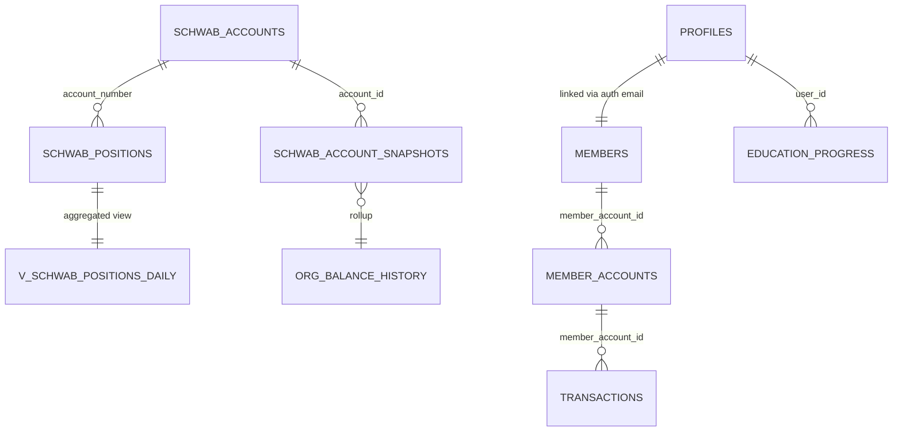

# FFA Investments Reconstruction Guide

_Last updated: 2025-11-26_

This guide is a self-contained blueprint for rebuilding the FFA Investments club portal, its Schwab integration backend, and the supporting Supabase database from scratch. It is based entirely on the current repository contents and is written so another engineer or AI can re-create the system without seeing the original source tree.

---

## 1. High-Level System Summary

**Purpose**
- Member-facing portal for investment club participants (timeline feed, contribution tracking, education content, unit price history).
- Admin console for managing members, uploading data, and running Schwab-derived financial workflows.
- Integration with Charles Schwab Trader API to pull account balances, positions, and roll them into internal org history metrics.

**Core Features**
- **Member portal**: feed (`api_get_member_feed` RPC), contribution forms, member directory, education/catalog content.
- **Admin dashboard**: user management, unit price entry, data imports, debug tools, Schwab automation controls.
- **Schwab integration**:
  - OAuth handshake initiated from frontend, completed on a dedicated Express service hosted on Render.
  - Frontend `schwabApi` client manages tokens in browser storage and proxies account/position requests to Schwab.
  - Snapshot service writes balances into Supabase tables with raw JSON for auditing.
  - Position sync service stores per-security holdings; rollup RPC consolidates daily values into `org_balance_history`.

**Tech Stack**
- **Frontend**: React 18 + Vite, Tailwind-derived styling (`styles/app.css`, `index.css`), auxiliary UI libs (`lucide-react`, `recharts`, `@tanstack/react-query`).
- **State/data**: Supabase JavaScript SDK for auth and database access; local placeholder API (`base44`) used for fixtures and offline data seeding.
- **Backend**: Custom Express server (`backend/index.js`) deployed on Render to perform Schwab OAuth token exchanges using Supabase service-role credentials.
- **Database**: Supabase Postgres with extensive RLS, views, and RPCs defined in `supabase-schema.sql` and `supabase/*.sql`. Schwab-specific tables (`schwab_accounts`, `schwab_account_snapshots`, `schwab_positions`, `org_balance_history`) live in `supabase/`.

---

## 2. Repository Layout (Key Directories & Files)

```
FFAInvestments/
├─ package.json             # Vite/React project config & scripts (frontend)
├─ vite.config.js           # HTTPS dev cert support, module aliases, build tuning
├─ vercel.json              # Vercel deployment config for SPA + /api proxy
├─ README.md                # High level product description (duplicated sections)
├─ backend/
│  └─ index.js              # Express server for Schwab OAuth/token lifecycle (Render)
├─ src/
│  ├─ main.jsx              # React bootstrap with ErrorBoundary
│  ├─ App.jsx               # Router + route definitions + providers
│  ├─ Layout.jsx            # Shared layout shell
│  ├─ components/
│  │  ├─ Admin*             # Legacy admin widgets (many replaced by Pages/*)
│  │  ├─ ProtectedRoute.jsx # Guard that checks auth role flags
│  │  └─ ...                # Login, dashboards, modals, etc.
│  ├─ contexts/
│  │  └─ AuthContext.jsx    # Supabase session context + provider
│  ├─ lib/
│  │  ├─ supabase.js        # Supabase client bootstrap (env validation)
│  │  ├─ authHooks.js       # `useCurrentMember` hook (Supabase + RPC fetch)
│  │  └─ ffaApi.js          # REST helpers for backend endpoints
│  ├─ services/
│  │  ├─ schwabApi.js       # Frontend Schwab client (OAuth, accounts, positions)
│  │  ├─ schwabSnapshots.js # Snapshot capture & Supabase writes
│  │  └─ schwabPositions.js # Positions sync & Supabase persistence
│  ├─ Pages/
│  │  ├─ AdminSchwab.jsx            # Main Schwab admin console (connect/disconnect, accounts)
│  │  ├─ SchwabInsights.jsx         # Interactive insights + positions table
│  │  ├─ SchwabInsightsPage.jsx     # Wrapper that injects layout + guard
│  │  ├─ SchwabRawData.jsx          # API sandbox for Schwab endpoints
│  │  ├─ AdminDashboard.jsx, ...    # Admin feature areas (ledger, unit price, education)
│  │  ├─ MemberDashboard.jsx, ...   # Member experiences (feed, contribute, settings)
│  │  └─ SchwabCallback.jsx         # Handles OAuth callback from Schwab
│  ├─ api/base44Client.js    # Local mocked API (fixtures, offline login)
│  └─ styles/index.css       # Global theme / Tailwind-inspired utility classes
├─ supabase/
│  ├─ schwab_tables.sql             # Accounts & snapshots schema + RLS policies
│  ├─ schwab_positions.sql          # Positions table + indexes
│  ├─ org_balance_history.sql       # Org balance history table schema
│  └─ schwab_org_balance_rollup.sql # View + RPC for daily rollups
├─ database/
│  ├─ unified_member_system.sql     # Members table augmentation + composite view
│  ├─ clean_members_setup.sql       # Initial member roster + RLS policies
│  └─ rpc/api_get_member_feed.sql   # Member feed RPC (cursor pagination)
├─ docs/
│  └─ (created by this guide)
└─ supabase-schema.sql      # Monolithic schema: profiles, unit prices, RLS, policies
```

---

## 3. Database & Supabase Schema Summary

### 3.1 Schwab Tables

| Table/View | Columns & Purpose | Notes |
|------------|-------------------|-------|
| `public.schwab_accounts` | `id BIGSERIAL PK`, `account_number TEXT UNIQUE`, `account_type TEXT`, `account_hash TEXT`, `is_active BOOLEAN`, `first_seen_at`, `last_updated_at`, `raw_account_data JSONB` | Populated/upserted by `captureSchwabSnapshot()`. Stores both human display number and Schwab `hashValue`. RLS permits service-role write, authenticated read. Trigger `update_schwab_account_timestamp` keeps `last_updated_at` fresh. |
| `public.schwab_account_snapshots` | `id BIGSERIAL PK`, FK `account_id` → `schwab_accounts(id)`, `snapshot_date TIMESTAMPTZ`, balance metrics (`liquidation_value`, `cash_balance`, `long_market_value`, etc.), `aggregated_balance JSONB`, `raw_snapshot_data JSONB` | Unique constraint on `(account_id, snapshot_date)` ensures idempotent daily inserts. RLS: service-role full access; authenticated read. |
| `public.schwab_positions` | `id UUID DEFAULT gen_random_uuid()`, `account_number TEXT`, `as_of_date DATE`, `symbol`, `description`, `asset_type`, `quantity NUMERIC`, `price NUMERIC`, `market_value NUMERIC`, `cost_basis NUMERIC`, `side TEXT`, `raw_json JSONB`, timestamps | Index `idx_schwab_positions_acct_date` supports daily lookups. Each sync operation deletes + re-inserts rows per `(account_number, as_of_date)` for idempotency. |
| `public.v_schwab_positions_daily` | View defined in `schwab_org_balance_rollup.sql` computing `sum(market_value)` per `account_number, as_of_date` | Used by rollup RPC to calculate positions value. |
| `public.org_balance_history` | `id UUID DEFAULT gen_random_uuid()`, `org_id UUID NULL`, `balance_date DATE NOT NULL`, `source TEXT` (e.g. `'schwab_positions'`), `total_value`, `cash_value`, `positions_value`, `metadata JSONB`, timestamps | Populated by RPC `public.api_roll_schwab_into_org_balance(p_date)` via upsert (`ON CONFLICT(balance_date, source)` updates existing row). Provides aggregated metrics for historical charts.

### 3.2 Schwab Tokens (backend expectation)
- Backend inserts into `public.schwab_tokens` (fields: `access_token`, `refresh_token`, `expires_in`, `scope`, `token_type`, `received_at`, `state`). Schema definition is not in repo—create a simple table with those columns plus UUID PK before deploying the backend.

### 3.3 Member & Portfolio Tables

| Table/View | Columns | Usage |
|------------|---------|-------|
| `public.members` (from `database/members_setup.sql`) | `id UUID`, `email TEXT UNIQUE`, `member_name`, `full_name`, `first_name`, `last_name`, `phone`, `join_date`, `membership_status`, `dues_status`, `last_payment_date`, `notes`, `role`, `auth_user_id`, `claimed_at`, timestamps, `member_account_id` | Core roster. Linking now happens exclusively through the `claim_member_for_current_user` RPC invoked by the claim UI; no auto-link triggers remain. RLS allows broad read plus RPC-driven updates. |
| `public.member_accounts` | `id UUID`, `user_id UUID`, `member_name TEXT`, `current_units`, `total_contributions`, `current_value`, `ownership_percentage`, etc. | Admin-managed investment account metrics. RLS differentiates admin vs member privileges (`member_accounts self read`, etc.). |
| `public.unit_prices` | `price_date DATE UNIQUE`, `unit_price DECIMAL(10,4)`, totals, `created_by`, timestamps | Admin enters NAV/unit price history; members get read-only access. |
| `public.transactions` | `member_account_id FK`, `transaction_type`, `amount`, `units`, `unit_price`, `transaction_date`, `description`, `processed_by`, `created_at` | Tracks contributions, withdrawals. RLS allows admins full CRUD; members view own via `member_accounts` link.
| `public.education_progress` | `user_id`, `lesson_id`, `completed_at`, `score`, `time_spent_minutes` | Drives education completion percentages in UI.
| `public.complete_member_profiles` (view) | Enriched view merging `members`, Supabase `auth.users`, `profiles`, `member_accounts`, latest unit price, timeline data, transaction/education aggregates | Used by admin dashboards for holistic member view.
| `public.ffa_timeline` | Historical club performance metrics (columns: `report_month`, `portfolio_value`, etc.). RLS ensures admin control while allowing member read for charts.

### 3.4 Auth & Profiles
- `public.profiles`: Mirror of Supabase `auth.users`, adds `display_name`, `role ('admin'|'member')`, `avatar_url`, `settings JSONB`. RLS uses helper function `public.is_admin()`.
- `public.orgs` / `public.org_members`: Multi-org scaffolding. Admin policies allow owner/admin to manage membership.
- Extensive RLS policy blocks in `supabase-schema.sql` covering each table with separate admin vs member permissions.

### 3.5 RPCs & Functions
- `public.api_get_member_feed(limit_count integer, cursor_timestamp timestamptz)` – paginated member feed with `like_count`, `comment_count`, `liked_by_me` (uses `auth.uid()` and admin role checks).
- `public.api_roll_schwab_into_org_balance(p_date date)` – merges `schwab_account_snapshots` + `v_schwab_positions_daily` data into `org_balance_history` with UPSERT semantics.
- `public.is_admin()` – security definer used in RLS to test caller role.
- `claim_member_for_current_user` RPC – security-definer function used by the claim UI to attach Supabase users to imported member rows.

---

## 4. Schwab Integration Flow (End to End)

### 4.1 Frontend Schwab Client (`src/services/schwabApi.js`)
- Configured via Vite env (`VITE_SCHWAB_CLIENT_ID`, `VITE_SCHWAB_REDIRECT_URI`, `VITE_SCHWAB_ALLOWED_REDIRECTS`, `VITE_BACKEND_URL`).
- Generates OAuth URL (`getAuthorizationUrl`):
  - Picks best redirect URI matching current window origin.
  - Creates PKCE-like `state` stored in local caches and `localStorage`.
  - Scope defaults to `read`.
- Handles callback (`handleOAuthCallback`):
  - Parses `code`/`state` from URL, validates stored state.
  - POSTs to backend `/api/schwab/exchange` with `code` and chosen redirect.
  - Stores response tokens in `localStorage` (`schwab_tokens`) with `expires_at`.
- Token refresh via `/api/schwab/refresh` when access token near expiry.
- Account + positions retrieval:
  - `getAccounts()` hits Schwab `/trader/v1/accounts`; returns array.
  - `getPositionsForAccount(accountNumber)` (reliability fix) fetches `/trader/v1/accounts?fields=positions` and filters by `securitiesAccount.accountNumber`; logs warnings if not found.
  - Deprecated `getAccountDetails(accountNumber)` still calls `/trader/v1/accounts/{accountNumber}?fields=positions` but now wraps errors with detailed logging when Schwab returns HTTP 400 "Invalid account number".
- Exposes helper `getAuthStatus()` (based on local tokens) for UI gating and debug panel.

### 4.2 Backend Schwab Server (`backend/index.js`)
- Express app with CORS restricted to `FRONTEND_ORIGIN` (defaults to hosted domain fallback) and allowed redirect URIs from env.
- Environment variables: `SUPABASE_URL`, `SUPABASE_SERVICE_ROLE_KEY`, `SCHWAB_CLIENT_ID`, `SCHWAB_CLIENT_SECRET`, `SCHWAB_REDIRECT_URI`, `SCHWAB_REDIRECT_URI_ALLOWED`, `SCHWAB_AUTH_URL`, `SCHWAB_TOKEN_URL`, `PORT`.
- Routes:
  - `GET /health` – simple status probe (for Render health checks).
  - `GET /api/schwab/auth` – server-side redirect helper (unused but available).
  - `POST /api/schwab/exchange` – exchanges auth code for tokens; note duplicate route definition (legacy + preferred). Uses `requestToken` helper with `grant_type=authorization_code` and canonical redirect.
  - `POST /api/schwab/refresh` – obtains new access token using `grant_type=refresh_token`.
- Token exchange mechanics:
  - `requestToken` sends `Authorization: Basic base64(client_id:client_secret)` header and `application/x-www-form-urlencoded` payload.
  - Parses JSON body; if error, logs entire response body snippet.
  - Normalizes tokens by computing `expires_at` using `Date.now() + expires_in*1000`.
- Token persistence:
  - Inserts sanitized tokens into Supabase table `schwab_tokens` (requires manual creation – see §3.2). Logs success/failure.

### 4.3 Snapshot & Position Ingestion (`src/services`)
- `captureSchwabSnapshot()`:
  - `schwabApi.getAccounts()` → iterate accounts.
  - Upsert into `schwab_accounts` (`onConflict account_number`).
  - Fetch account details with `getPositionsForAccount(accountNumber)`.
  - Insert into `schwab_account_snapshots` (balance fields + `raw_snapshot_data`).
  - Returns summary list with account + snapshot metadata; handles duplicate snapshot via unique constraint.
- `syncSchwabPositionsForToday()`:
  - `getAccounts()` → pick first account (extend for multi-account by iterating as needed).
  - Call `getPositionsForAccount(accountNumber)` (post-fix) to avoid 400 errors.
  - Build insert rows with normalized fields (supports both long/short positions) and include raw JSON for auditing.
  - Delete existing rows for `(account_number, today)` before insert.
  - Returns summary object with `positions_count` for UI.

### 4.4 Rollup to Org History
- RPC `api_roll_schwab_into_org_balance(p_date)` (PL/pgSQL script):
  - Joins snapshots to accounts and aggregated positions view.
  - Inserts into `org_balance_history` with metadata JSON summarizing account mapping.
  - Conflict on `(balance_date, source)` updates values.
- UI (`SchwabInsights.jsx`) exposes button to trigger this RPC via Supabase JS client.

### 4.5 Known Schwab Error States & Mitigations
- **400 Invalid account number** – occurs when hitting `/accounts/{accountNumber}?fields=positions`; mitigated by `getPositionsForAccount()` using bulk endpoint and client-side filtering. Error logging now captures response payload + account number.
- **Redirect URI mismatch** – ensure `SCHWAB_REDIRECT_URI_ALLOWED` matches front-end redirect; Vite config supports local HTTPS via `localhost.pem`. `.env.example` lists allowed URIs.
- **Token persistence failures** – backend logs Supabase insert errors; requires `schwab_tokens` table + service-role key.
- **RLS errors (Supabase)** – `member_posts`, `unit_prices`, `member_accounts` have policies requiring admin role; ensure `profiles.role` seeded and `AuthProvider` session established.

---

## 5. Frontend Route & Feature Map

| Route | Component(s) | Data Dependencies | Primary Actions |
|-------|--------------|-------------------|-----------------|
| `/login` | `ModernLogin` | local `base44` mock or Supabase auth | User login entry point. |
| `/auth/callback` | `AuthCallback` | Supabase session exchange | Handles Supabase magic-link / OAuth callback. |
| `/admin/dashboard` | `Layout` → `AdminDashboard` | Supabase tables (`unit_prices`, `member_accounts`, `ffa_timeline`), charts via `recharts` | Visual overview for admins. |
| `/admin` | `AdminPanel` | Mixed data; navigation hub | Quick links to subsystem modules. |
| `/admin/users` | `AdminUsers` / `AdminUsersNew` | `members`, `profiles`, `member_accounts` views | Manage user roles, invitations. |
| `/admin/accounts` | `AdminAccounts` | `member_accounts`, transaction history | Adjust member account metrics. |
| `/admin/ledger` | `AdminLedger` | `transactions`, `unit_prices` | Upload and reconcile ledger entries. |
| `/admin/unit-price` | `AdminUnitPrice` | `unit_prices` table | CRUD unit price history; charts. |
| `/admin/schwab` | `AdminSchwab` | Schwab `getAccounts`, `schwab_tokens`; uses `schwabApi`, `useCurrentMember` | Connect/disconnect Schwab, view linked accounts, navigate to insights/raw data. |
| `/admin/schwab/insights` | `SchwabInsightsPage` → `SchwabInsights` | Schwab positions, Supabase snapshots, RPC rollup | Capture snapshots, list positions, trigger inserts into `org_balance_history`. |
| `/admin/schwab/raw-data` | `SchwabRawData` | Schwab API responses (JSON), copy/download utilities | Sandbox to test endpoints, view raw positions JSON; features history and CSV export for accounts. |
| `/admin/import` | `AdminImport` | `unit_prices`, `transactions`, file uploads | Bulk data ingestion. |
| `/admin/settings` | `AdminSettings` | Supabase `profiles`, settings JSON | Manage club-wide settings. |
| `/admin/members` | `AdminMembers` | `complete_member_profiles` view | Manage roster, statuses, ties to auth accounts. |
| `/member/home` | `MemberHome` | `api_get_member_feed` RPC, `member_posts` | Member timeline and updates. |
| `/member/feed` | `MemberFeed` | same as above + likes/comments tables | Post interactions. |
| `/member/contribute` | `MemberContribute` | `useCurrentMember`, Supabase RPCs/action endpoints | Contribution workflow protected by `useCurrentMember` hook. |
| `/member/dashboard` | `MemberDashboardNew` | `member_accounts`, `unit_prices`, `transactions` | Member view of own holdings and performance. |
| `/member/directory` | `MemberDirectory` | `members`, `profiles` | Contact list for members. |
| `/unit-price` | `UnitValueSystemGuide` / `UnitValueSystemEducation` | Static + `unit_prices` table | Education on unit value system. |
| `/admin/debug-auth` | `AdminDebugAuth` | Supabase auth session info | Troubleshooting tool for admins.

All routes are wrapped in `ProtectedRoute`, which checks Supabase auth state via `AuthProvider`. Admin routes require `requireAdmin` prop (checks `profile.role === 'admin'`). `useCurrentMember` is now required for Schwab pages to ensure SSR-friendly access control.

---

## 6. Architecture Diagrams

### 6.1 System Flow

```mermaid
flowchart LR
  Browser[React + Vite SPA]\n(AuthProvider, useCurrentMember) -->|Supabase JS SDK| SupabaseAuth[(Supabase Auth)]
  Browser -->|RPCs / REST| SupabaseDB[(Supabase Postgres)]
  Browser -->|OAuth start, token exchange (via fetch)| RenderBackend[Express Schwab Backend]
  RenderBackend -->|Authorization Code Grant| SchwabOAuth[(Schwab OAuth Service)]
  Browser -->|Trader API (accounts, positions)| SchwabAPI[(Schwab Trader API)]
  RenderBackend -->|Persist tokens (service role)| SupabaseDB
  Browser -->|captureSchwabSnapshot()/syncSchwabPositionsForToday()| SupabaseDB
  SupabaseDB -->|api_roll_schwab_into_org_balance| OrgHistory[(org_balance_history)]
  OrgHistory -->|Charts & Reports| Browser
```

### 6.2 Database Relationships



---

## 7. Runbook: Rebuilding & Operating the System

### 7.1 Prerequisites
1. **Tooling**: Node.js ≥ 18.x, npm ≥ 9.x, Git.
2. **Supabase project**: create new project, capture `SUPABASE_URL`, `anon` key, `service_role` key.
3. **Schwab Developer account**: register application for Trader API access. Configure redirect URIs (production + local HTTPS).
4. **Certificates for local Schwab OAuth**: follow `HTTPS_SETUP.md` (not in repo) to create `localhost.pem` & `localhost-key.pem`, or install mkcert certs (`localhost+2.pem`).

### 7.2 Environment Variables

#### Frontend (`.env`, Vite)
```
VITE_SUPABASE_URL=<https://xyz.supabase.co>
VITE_SUPABASE_ANON_KEY=<anon-key>
VITE_SCHWAB_CLIENT_ID=<schwab-app-client-id>
VITE_SCHWAB_REDIRECT_URI=https://yourapp.com/admin/schwab/callback
VITE_SCHWAB_ALLOWED_REDIRECTS=https://yourapp.com/admin/schwab/callback,https://localhost:3000/admin/schwab/callback
VITE_BACKEND_URL=https://ffainvestments.onrender.com   # or local backend URL
```

#### Backend (`backend/.env` or Render dashboard)
```
PORT=4000
SUPABASE_URL=<https://xyz.supabase.co>
SUPABASE_SERVICE_ROLE_KEY=<service-role>
SCHWAB_CLIENT_ID=<schwab-app-client-id>
SCHWAB_CLIENT_SECRET=<schwab-app-client-secret>
SCHWAB_REDIRECT_URI=https://yourapp.com/admin/schwab/callback
SCHWAB_REDIRECT_URI_ALLOWED=...comma-delimited list incl. local HTTPS...
SCHWAB_AUTH_URL=https://api.schwab.com/v1/oauth/authorize
SCHWAB_TOKEN_URL=https://api.schwab.com/v1/oauth/token
FRONTEND_ORIGIN=https://your-frontend-domain
```

### 7.3 Database Setup (Supabase SQL order)
1. Run `supabase-schema.sql` to establish baseline tables (`profiles`, `unit_prices`, `member_accounts`, RLS policies, helper functions).
2. Execute `database/clean_members_setup.sql` (or `unified_member_system.sql`) to seed `members`, link triggers, and views.
3. Run Schwab-specific SQL scripts in order:
   - `supabase/schwab_tables.sql`
   - `supabase/schwab_positions.sql`
   - Create `public.schwab_tokens` manually:
     ```sql
     create table if not exists public.schwab_tokens (
       id uuid primary key default gen_random_uuid(),
       access_token text,
       refresh_token text,
       expires_in integer,
       expires_at timestamptz,
       scope text,
       token_type text,
       received_at timestamptz not null default now(),
       state text
     );
     ```
   - `supabase/org_balance_history.sql`
   - `supabase/schwab_org_balance_rollup.sql`
4. Execute RPC scripts: `database/rpc/api_get_member_feed.sql` and any additional RPCs you require.
5. Seed additional data (unit prices, transactions) using provided scripts or admin UI after deployment.

### 7.4 Running Locally
1. **Frontend**
   ```bash
   npm install
   npm run dev
   ```
   - Vite dev server defaults to `https://localhost:3000` with auto HTTPS when certs present.
   - Use `?debug=1` query on `/admin/schwab` for token/status insights.

2. **Backend**
   ```bash
   cd backend
   npm install  # if package.json present; otherwise reuse root dependencies
   node index.js  # or npm start (per package.json script)
   ```
   - Exposes `http://localhost:4000`. In dev, set `VITE_BACKEND_URL=https://localhost:4000` (with valid TLS proxy or use `https://127.0.0.1` + certificate).

### 7.5 Deploying

**Frontend (Vercel)**
- Import repo, choose `main` branch.
- Build command: `npm run build`; output dir `dist` (already in `vercel.json`).
- Set env vars (matching `.env` values). Ensure `VITE_BACKEND_URL` points to Render backend URL.
- Add custom domain + HTTPS.

**Backend (Render)**
- Create "Web Service" from `backend/` directory.
- Build command: `npm install && node index.js` (or use `npm start`).
- Health check path: `/health`.
- Supply environment variables (see §7.2). Ensure service-role key scoped correctly.
- Add allowed origins/redirect URIs for Schwab to align with production hosts.

### 7.6 Operational Flows

1. **Connect Schwab account**
   - Admin navigates to `/admin/schwab`.
   - Click "Connect to Charles Schwab" → `schwabApi.getAuthorizationUrl()` → backend exchange.
   - On success, tokens stored in browser & backend `schwab_tokens` table.

2. **Capture snapshots**
   - From `/admin/schwab/insights`, click "Capture snapshot now".
   - Calls `captureSchwabSnapshot()` → writes to `schwab_accounts` & `schwab_account_snapshots`.
   - UI displays last snapshot timestamp and balance summary.

3. **Sync positions**
   - Click "Refresh positions".
   - Runs `syncSchwabPositionsForToday()` → populates `schwab_positions` for current date.
   - Table shows holdings (handles both Schwab API format and DB format).

4. **Roll Schwab into org history**
   - Use "Save snapshot to org history" button to invoke `supabase.rpc('api_roll_schwab_into_org_balance', { p_date: today })`.
   - Confirms entry in `org_balance_history` for use in dashboards.

5. **Debugging common errors**
   - **Invalid account number**: ensures `getPositionsForAccount()` is used; check logs in browser console (positions JSON viewer) and backend logs for filtered accounts list.
   - **Redirect URI mismatch**: verify both frontend `.env` and backend `SCHWAB_REDIRECT_URI_ALLOWED` include the deployed callback URL; inspect Vite dev server logs for HTTPS warnings.
   - **Supabase RLS denial**: confirm `profiles.role` set to `'admin'`; use `/admin/debug-auth` to inspect current session; verify service-role key in backend.
   - **Token refresh loops**: backend `schwab_tokens` insert failures show up in Render logs; ensure table exists + service-role key valid.

---

## 8. Known Issues & TODOs

- **Schwab tokens table schema missing**: backend expects `public.schwab_tokens`; create before running service or persist tokens elsewhere.
- **Duplicate `/api/schwab/exchange` route**: backend defines the endpoint twice (legacy + new). Refactor to a single implementation to avoid maintenance drift.
- **Hard-coded single-account sync**: `syncSchwabPositionsForToday()` only processes first account; extend to loop through all accounts for multi-account clubs.
- **Legacy local API (`base44Client`)**: placeholder login/data used alongside Supabase—clean up to prevent confusion between mock and real data sources.
- **README duplication**: file contains repeated sections and outdated URLs; refresh after redeployment.
- **Member feed tables**: underlying tables (e.g., `member_posts`, likes/comments) implied by RPC but schema not included here—ensure they exist or adjust RPC.
- **HTTPS certificates required for Schwab OAuth**: dev experience depends on generating local certs; document explicit steps or add script.
- **Env var sprawl**: multiple lists of allowed redirects/origins exist in `.env.example`, backend, and Schwab developer portal—keep synchronized to avoid mismatches.

---

With the above reference, an engineer can provision the database, configure environment variables, deploy frontend/backend, and operate the Schwab data ingestion pipeline without needing the original repository. Use this guide as the authoritative source when rehydrating the FFA Investments platform.
